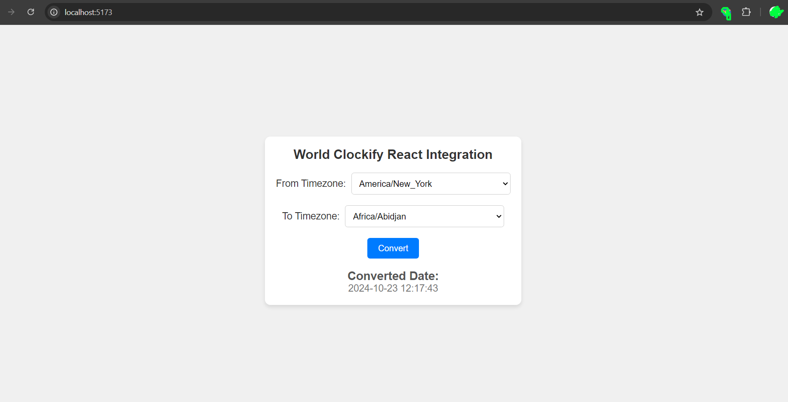

# Example App

You can take reference from the following code to integrate the library in your project.

`src/App.tsx`
```jsx
import React, { useState } from 'react';
import { formatDateInTimeZone, getSupportedTimezones } from 'world-clockify';
import './App.css'

const App: React.FC = () => {
  const [currentDate] = useState(new Date().toISOString());
  const [fromZone, setFromZone] = useState('America/New_York');
  const [toZone, setToZone] = useState('Asia/Kolkata');
  const [formattedDate, setFormattedDate] = useState('');

  const format = 'yyyy-MM-dd HH:mm:ss';

  const handleConvert = () => {
    const formatted = formatDateInTimeZone(currentDate, fromZone, toZone, format);
    setFormattedDate(formatted);
  };

  return (
    <div className="App">
      <h1>World Clockify React Integration</h1>
      
      <div>
        <label className='lbl'>From Timezone:</label>
        <select value={fromZone} onChange={(e) => setFromZone(e.target.value)}>
          {getSupportedTimezones().map((zone) => (
            <option key={zone} value={zone}>{zone}</option>
          ))}
        </select>
      </div>

      <div>
        <label className='lbl'>To Timezone:</label>
        <select value={toZone} onChange={(e) => setToZone(e.target.value)}>
          {getSupportedTimezones().map((zone) => (
            <option key={zone} value={zone}>{zone}</option>
          ))}
        </select>
      </div>

      <button onClick={handleConvert}>Convert</button>

      {formattedDate && (
        <div>
          <h2>Converted Date:</h2>
          <p>{formattedDate}</p>
        </div>
      )}
      </div>
  
  );
};

export default App;
```
Css file for the above code
`src/App.css`
```css
* {
  margin: 0;
  padding: 0;
  box-sizing: border-box;
}

html, body {
  height: 100%;
}

body {
  display: flex;
  justify-content: center;
  align-items: center;
  font-family: Arial, sans-serif;
  background-color: #f0f0f0;
}

.App {
  text-align: center;
  padding: 20px;
  background-color: white;
  border-radius: 10px;
  box-shadow: 0px 4px 8px rgba(0, 0, 0, 0.1);
}

h1 {
  margin-bottom: 20px;
  font-size: 24px;
  color: #333;
}

label {
  margin-right: 10px;
  font-size: 18px;
  color: #333;
}

select {
  margin-bottom: 20px;
  padding: 10px;
  font-size: 16px;
  border-radius: 5px;
  border: 1px solid #ccc;
}

button {
  padding: 10px 20px;
  background-color: #007bff;
  color: white;
  border: none;
  border-radius: 5px;
  cursor: pointer;
  font-size: 16px;
}

button:hover {
  background-color: #0056b3;
}

h2 {
  margin-top: 20px;
  font-size: 22px;
  color: #555;
}

p {
  font-size: 18px;
  color: #777;
}


```

## View
<div align="center">

</div>